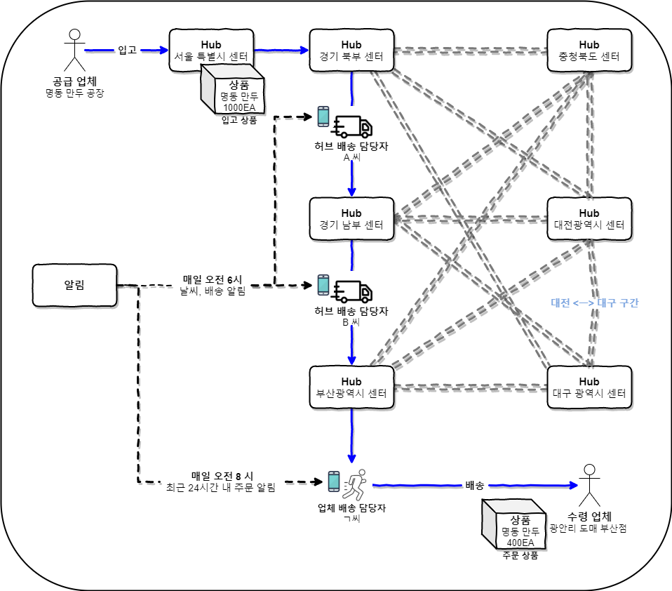
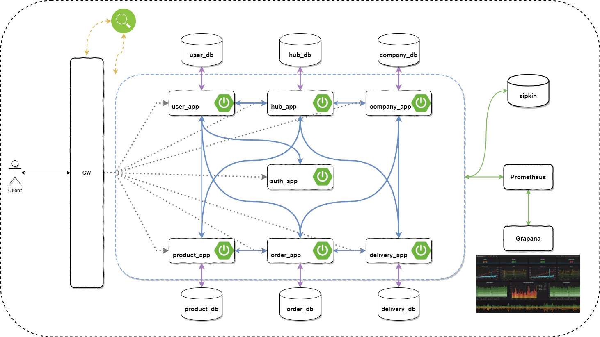
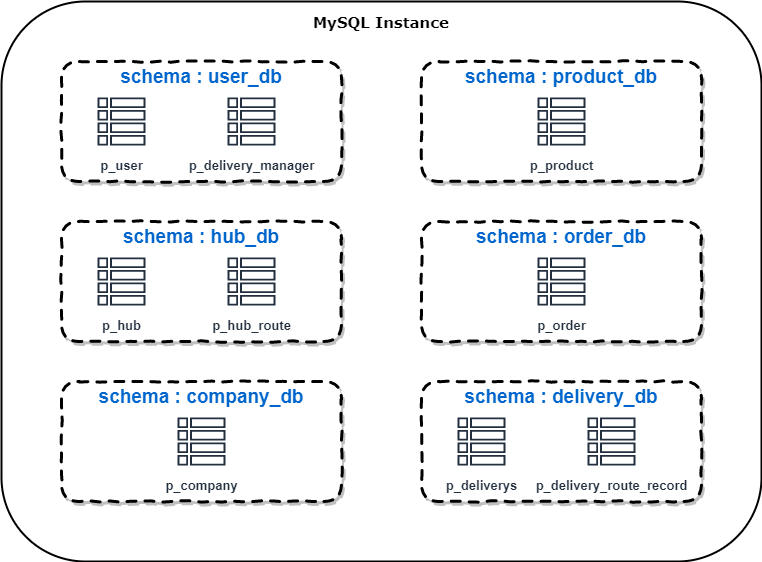
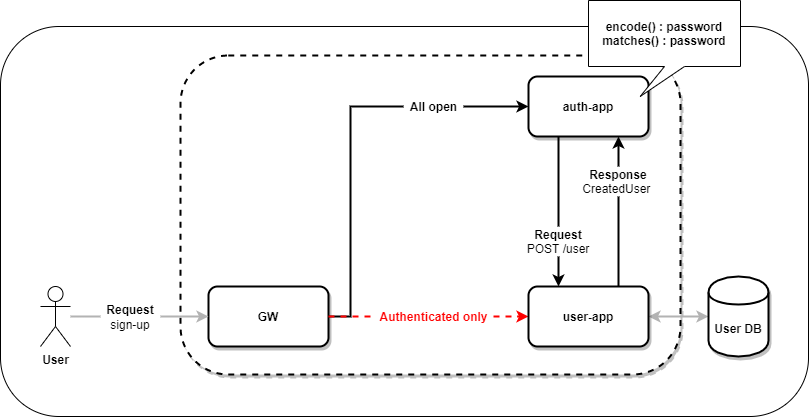
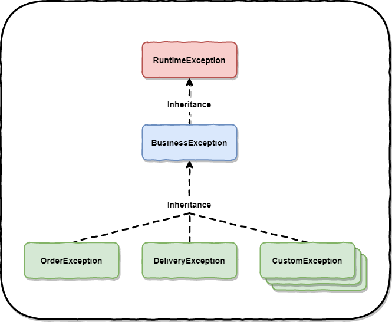
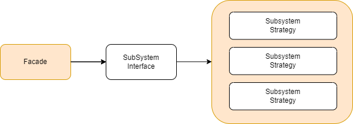
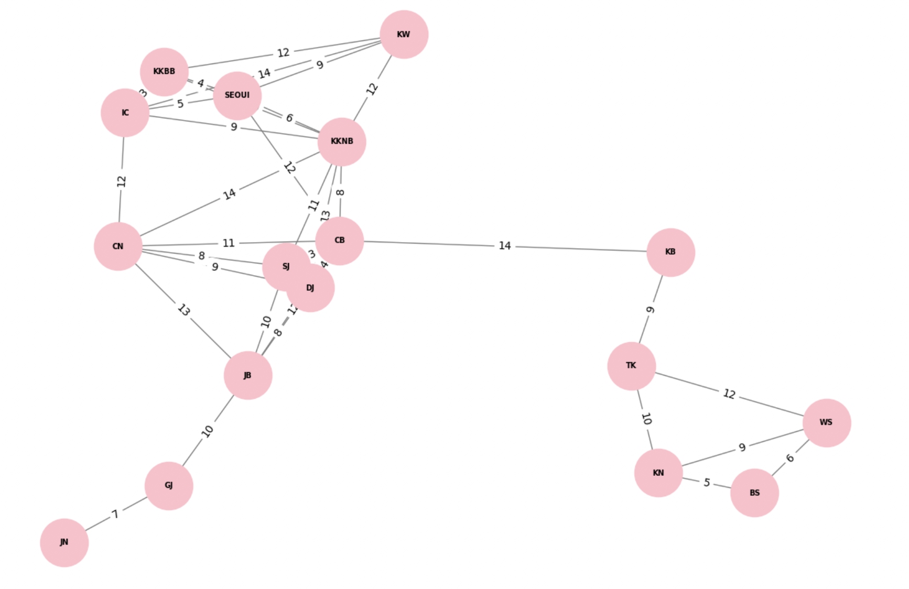

Project fulflix
===


> B2B 기반의 물류 시스템

---

# 설계 산출물

- [테이블 명세서](https://github.com/fulflix/fulflix/wiki/%ED%85%8C%EC%9D%B4%EB%B8%94-%EB%AA%85%EC%84%B8%EC%84%9C)
- [ERD](https://github.com/fulflix/fulflix/wiki/ERD)
- [API 명세서](https://bevel-seashore-dd5.notion.site/API-95fb6ccdb9cf4fc88804b2134e1949fd)

---

# 아키텍쳐

## 시스템 아키텍쳐



## 논리적 스키마 분리


---

# 사용 기술

## 🧙개발 환경

| 분류         | 상세                                       |
|------------|:-----------------------------------------|
| IDE        | IntelliJ, Datagrip                       |
| Language   | Java 17                                  |
| Framework  | Spring Boot 3.3.3, Spring Cloud 2023.0.3 |
| Repository | H2 In-memory, MySQL 8.0.35               |
| Build Tool | Gradle 8.10                              |

## 👩‍💻상세 개발 환경

### Dependencies

| Spring               | Data              | Cloud                  | Monitoring            | test           | ETC      |
|----------------------|:------------------|:-----------------------|:----------------------|----------------|----------|
| Spring Web           | Spring Data JPA   | Spring Cloud Gateway   | Micrometer Tracing    | JUnit          | Lombok   |
| Spring Validation    | Spring Data Redis | Spring Cloud Eureka    | Micrometer Openfeign  | Testcontainers | JJWT     |
| Spring Security      | Spring Kafka      | Spring Cloud OpenFeign | Micrometer Zipkin     | wireMock       | QueryDSL |
| Spring Boot Actuator |                   |                        | Micrometer Prometheus |                | Swagger  |
|                      |                   |                        |                       |                | JIB      |

### Docker compose

| Repository   | Monitoring    |
|--------------|:--------------|
| MySQL 8.0.35 | Zipkin        |
| Redis 7.4    | prometheus    |
| Kafka 3.3    | alert manager |
|              | node exporter |
|              | cadvisor      |
|              | grafana       |

---

# 주요 구현 사항

## 인증과 회원 분리



## GW 인증/인가


## 예외 처리




## 디자인 패턴(퍼사드 + 전략)을 이용한 비지니스 로직 분리



## 다익스트라 알고리즘을 이용한 허브 간 최단 경로 산출


---

# 빌드 및 구동

## 선행 사항

### - [Intellij Docker 설정](https://github.com/fulflix/fulflix/wiki/Intellij-Docker-%EC%84%A4%EC%A0%95)

## 1. docker compose 실행

```shell
docker compose up -d
```

## 2. project build

```shell
./build.sh
```

## 3. project run

```shell
./deploy.sh
```

## 4. project exit

```shell
./stop.sh
```

---

# 설계 대비 API 구현율

```kotlin
Fulflix API Count Summary
==========================
Module: [auth - app] - Total APIs : 4
├── GET: 1
├── POST: 3
Module: [company - app] - Total APIs : 9
├── GET: 6
├── POST: 1
├── PUT: 1
└── DELETE: 1
Module: [delivery - app] - Total APIs : 13
├── GET: 6
├── POST: 3
├── PUT: 2
└── DELETE: 2
Module: [hub - app] - Total APIs : 15
├── GET: 7
├── POST: 4
├── PUT: 2
└── DELETE: 2
Module: [order - app] - Total APIs : 16
├── GET: 7
├── POST: 5
├── PUT: 3
└── DELETE: 1
Module: [product - app] - Total APIs : 11
├── GET: 6
├── POST: 1
├── PUT: 3
└── DELETE: 1
Module: [user - app] - Total APIs : 6
├── GET: 4
├── POST: 1
└── DELETE: 1
==========================
Overall API Count
==========================
Total APIs : 74
├── GET: 37
├── POST: 18
├── PUT: 11
└── DELETE: 8
==========================
Implementation Rate : 100.00 % of 74 designed APIs

```

---

# 역할 분담

### [수인](https://github.com/jjong52)

- 다익스트라 알고리즘을 이용한 허브 간 최단 경로 산출
- Naver Map Directions 5 API를 이용한 허브간 실제 거리, 예상 이동 거리, 소요 기간 산출
- 허브/허브 경로 서비스 구현
- 배송/배송 경로 서비스 구현

### [예지](https://github.com/yezyaa)

- 디자인 패턴을 이용한 권한 별 로직 분리
- 주문 서비스 구현
- 주문 시 재고 관리(차감/원복)
- 업체 서비스 구현
- 상품 서비스 구현

### [용석](https://github.com/choi-ys)

- ThreadLocal 기반의 Custom Context Holder 구현
- 모니터링 환경 구성
- 공통 모듈 구현
- GW 구현
- 회원 서비스 구현
- jib을 이용한 local 환경 Dockerizing
- 일관된 테스트 실행 환경 구성
- ThreadLocal 기반의 Custom Context Holder 구현
